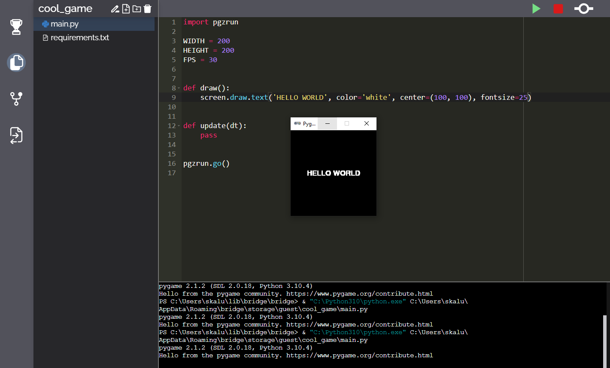

# Bridge
## Desktop first app built  for teaching code to kids

The goal is to make teaching code as good as in pearson or better.

App consists of three main parts:
- GUI interface to package management(To make installing programs/languages/dependencies as easy as a click of a button)
- git management system(to get fast and easy access to code, enabling real time collaboration)
- Tiket like assignment system(to introduce gamification of learning)

## Tecnologies

- React
- Typescript
- Electron
- Chocolotey(windows pkg manager)
- brew(mac os pkg manager)(TODO)
